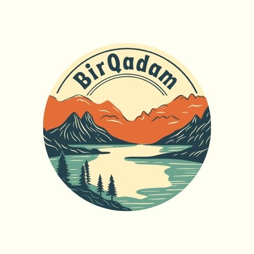

# BirQadam Full Stack Project 🌱

<div align="center">
  
  
  **Комплексная платформа для управления волонтерскими проектами в Алматы**
  
  [](https://flutter.dev)
  [](https://www.djangoproject.com/)
  [](https://www.python.org/)
  [](LICENSE)
</div>

---

## 📖 О проекте

**BirQadam** (ранее CleanUpAlmaty) - это полнофункциональная платформа для координации волонтерской деятельности, включающая:

- 📱 **Мобильное приложение** (Flutter) для iOS и Android
- 🌐 **Веб-приложение** (Flutter Web)
- 🔧 **Backend API** (Django REST Framework)
- 🎨 **Admin Panel** (Vue.js + Django)
- 🤖 **Telegram бот** для уведомлений и регистрации

---

## 📁 Структура проекта

```
BirQadamFull/
├── BirQadamApp/          # Flutter мобильное приложение
│   ├── lib/              # Исходный код Dart
│   ├── android/          # Android конфигурация
│   ├── ios/              # iOS конфигурация
│   └── README.md         # Документация приложения
│
├── BirQadamDjango/       # Django Backend + Admin Panel
│   ├── core/             # Основные модели и API
│   ├── custom_admin/     # Расширенная админ-панель
│   ├── frontend/         # Vue.js фронтенд для админки
│   ├── bot/              # Telegram бот
│   └── README.md         # Документация backend
│
├── Procfile              # Конфигурация для Railway/Heroku
└── railway.json          # Конфигурация Railway
```

---

## ✨ Основные возможности

### Для волонтеров:
- 🎯 Просмотр и участие в проектах
- ✅ Управление задачами с дедлайнами
- 📊 Отслеживание прогресса и статистики
- 🏆 Система достижений и рейтинга
- 📸 Загрузка фотоотчетов
- 🔔 Push-уведомления (FCM)
- 📍 Геолокация проектов
- 💬 Чат с организаторами

### Для организаторов:
- 📝 Создание и управление проектами
- 👥 Назначение задач волонтерам
- 📈 Мониторинг участников
- ✅ Модерация фотоотчетов
- 📊 Статистика проектов
- 🔔 Массовые рассылки
- 🗓️ Календарь событий

---

## 🛠 Технологии

### Mobile App (BirQadamApp)
- **Flutter** 3.24.0
- **Dart** 3.0
- **Provider** - State Management
- **Firebase** - Push Notifications
- **Google Maps** - Карты и геолокация

### Backend (BirQadamDjango)
- **Django** 5.2
- **Django REST Framework** 3.15
- **PostgreSQL** - База данных
- **Celery** - Асинхронные задачи
- **Redis** - Кэширование
- **Firebase Admin SDK** - Push уведомления
- **python-telegram-bot** - Telegram интеграция

### Admin Panel (BirQadamDjango/frontend)
- **Vue.js** 3
- **TypeScript**
- **Vuetify** - UI компоненты
- **Pinia** - State Management
- **Vite** - Build tool

---

## 🚀 Быстрый старт

### Мобильное приложение

```bash
cd BirQadamApp
flutter pub get
flutter run
```

Подробнее: [BirQadamApp/README.md](BirQadamApp/README.md)

### Backend API

```bash
cd BirQadamDjango
python -m venv venv
source venv/bin/activate  # Windows: venv\Scripts\activate
pip install -r requirements.txt
python manage.py migrate
python manage.py runserver
```

Подробнее: [BirQadamDjango/README.md](BirQadamDjango/README.md)

### Admin Panel

```bash
cd BirQadamDjango/frontend
npm install
npm run dev
```

---

## 📦 Развертывание

Проект настроен для развертывания на:
- **Railway** - Backend и Frontend
- **Heroku** - Backend (через Procfile)
- **Firebase** - Push уведомления
- **Google Play / App Store** - Мобильное приложение

---

## 👥 Команда

- **Backend Developer**: Beybit Kazbanov
- **Mobile Developer**: Flutter Team
- **UI/UX Designer**: Design Team

---

## 📞 Контакты

- **Email**: kazban0v.beybit@gmail.com
- **GitHub**: [@kazban0v](https://github.com/kazban0v)
- **Telegram Bot**: @VolunteerDlyaLyudei_bot

---

## 📄 Лицензия

MIT License - см. файл LICENSE для деталей

---

<div align="center">
  <p>Сделано с ❤️ для волонтеров Алматы</p>
  <p><b>BirQadam</b> - Вместе делаем город чище! 🌱</p>
</div>

